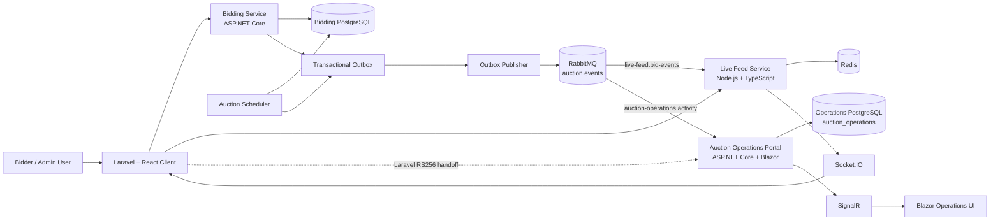

# Distributed Bidding Auction Platform

An end-to-end distributed auction platform demonstrating concurrency-safe bidding, transactional event publication, independent event consumers, real-time delivery, historical operations reporting, and measured .NET runtime behavior.

The repository is a portfolio and engineering demonstration. It is not a production deployment blueprint: TLS, secret management, capacity planning, compliance controls, and multi-instance operational hardening still need to be designed for a real deployment.

## Overview

The platform separates command handling from event-driven projections. Bidding Service decides whether a bid is accepted; Live Feed serves public real-time browser updates; the Auction Operations Portal independently persists operational activity for authenticated Blazor users, history, and reports.

## Architecture



The two consumers are intentionally independent. The Node Live Feed queue and the portal activity queue have separate bindings, retry/DLQ behavior, and storage boundaries. Portal activity is an operational projection; it never becomes authoritative auction state.

The platform contains:

- a Laravel + React bidder/admin client;
- an ASP.NET Core Bidding Service with optimistic concurrency around `Auction.Version`;
- an Auction Scheduler and transactional Outbox Publisher;
- RabbitMQ fan-out on the `auction.events` exchange;
- a Node.js/TypeScript Live Feed using Redis and Socket.IO;
- an authenticated ASP.NET Core + Blazor Auction Operations Portal;
- PostgreSQL-backed operational history, PDF reporting, SignalR delivery, and focused observability;
- an isolated BenchmarkDotNet project for runtime and allocation experiments.

See the [system architecture notes](docs/architecture.md), [event catalog](docs/event-catalog.md), and [demo walkthrough](docs/demo-walkthrough.md) for deeper subsystem detail.

## Demo Screenshots


## Core Components

| Component | Responsibility |
| --- | --- |
| Laravel + React Client | Bidder/admin web experience, Laravel identity authority, and portal handoff entry point |
| Bidding Service | Validates and accepts bids; owns authoritative auction state and concurrency |
| Auction Scheduler | Applies scheduled auction lifecycle transitions in the bidding database and writes lifecycle outbox events |
| Outbox Publisher | Publishes committed outbox events to RabbitMQ |
| RabbitMQ | Durable event exchange and independent consumer queues |
| Live Feed Service | Consumes live bid events, applies Redis idempotency/version checks, and emits Socket.IO updates |
| Auction Operations Portal | Consumes activity events, stores an independent projection, serves authenticated live/history/reporting views |
| PostgreSQL | Separate bidding and operations databases; the portal owns `auction_activity` |
| Redis | Live Feed idempotency and version state; not a portal source of truth |

Subsystem documentation:

- [Auction Operations Portal](apps/auction-operations-portal/README.md)
- [Client](apps/client/README.md)
- [Architecture reference](docs/architecture.md)
- [Failure scenarios](docs/failure-scenarios.md)

## Event Flow

Accepted bid command flow:

```text
Laravel/React Client
  ->
Bidding Service
  -> validate auction and current state
  -> PostgreSQL transaction
       - insert bid
       - update auction/version
       - insert outbox event
  -> commit
  -> Outbox Publisher
  -> RabbitMQ auction.events
```

The Bidding Service owns the bid decision. Optimistic concurrency conflicts are retried according to the service’s existing policy; a successfully accepted bid increments the aggregate version exactly once, while a rejected bid does not mutate the aggregate version. The outbox record is committed atomically with the authoritative state change. The publisher later delivers the committed event; RabbitMQ is not on the synchronous bid-acceptance path.

RabbitMQ fans out to separate durable queues:

```text
auction.events
   |
   +--> live-feed.bid-events
   |      -> Node Live Feed
   |
   +--> auction-operations.activity
          -> .NET Auction Operations Portal
```

One consumer cannot steal messages from the other because the queues and bindings are separate. Delivery is at least once. The portal uses database-enforced EventId idempotency; `AuctionClosed` and `WinnerSelected` can share an `AggregateVersion` while remaining distinct events because their EventIds differ.

The two real-time paths are deliberately different:

```text
RabbitMQ -> Node Live Feed -> Redis ordering/idempotency -> Socket.IO -> Laravel/React browser
RabbitMQ -> Portal consumer -> PostgreSQL -> SignalR -> Blazor Operations UI
```

The Node path is optimized for public live-feed delivery. The portal path persists before SignalR publication; SignalR is best-effort, and reconnect reconciliation reloads recent persisted activity. PostgreSQL is the operations source of truth. Portal history and PDF reports query PostgreSQL, not Bidding Service tables or Redis.

Delivery is at least once. `EventId` is the idempotency key. `AggregateVersion` is observational metadata and is not globally unique: `AuctionClosed` and `WinnerSelected` can legitimately share a version while remaining distinct events.

## Authentication Flow

Laravel remains the username/password and admin identity authority:

```text
User
  -> Laravel login
  -> access-admin gate
  -> short-lived RS256 handoff token
  -> Auction Operations Portal
  -> validate issuer/audience/permission/JTI
  -> short-lived HttpOnly portal cookie
```

1. An authenticated user passes Laravel’s existing admin gate.
2. Laravel issues a short-lived RS256 handoff token with the existing issuer, audience `auction-operations-portal`, permission `access-auction-operations`, role, subject, expiry, and JTI.
3. The browser submits the token to the portal’s `POST /auth/handoff` endpoint.
4. The portal validates the signature using only Laravel’s public key, exact issuer/audience, expiry, subject, role, permission, and single-use JTI.
5. The portal creates a short-lived HttpOnly authentication cookie and never stores the JWT in browser storage.

Portal pages and the SignalR hub require the `AuctionOperationsAdmin` policy. Portal logout clears only the portal cookie and redirects to a configured safe Laravel destination. The existing Node Live Feed authentication flow remains separate and unchanged.

Laravel holds the private signing key. Node Live Feed and the Operations Portal receive public-key copies only. The portal uses the dedicated audience `auction-operations-portal` and permission `access-auction-operations`; it does not reuse the Node audience. Portal JTI replay protection is currently in-memory and single-instance, so distributed replay storage is required before horizontally scaling portal authentication.

## Operations Portal

The portal is an independent consumer and projection:

- `/activity/live`: bounded recent activity plus authenticated SignalR updates;
- `/activity/history`: UTC date-range, aggregate ID, event-type, and server-side pagination filters;
- `GET /activity/report.pdf`: authenticated, rate-limited PDF reports using the same validated filters;
- `/health`: anonymous aggregate health status for PostgreSQL and RabbitMQ.

History uses inclusive UTC boundaries, a maximum 31-day range, exact aggregate filtering, known event-type filtering, page sizes of 25/50/100, and deterministic ordering by `OccurredAtUtc` then `Id`. Reports reuse those filters, use chronological ordering, compute server-side summary counts, and reject results over 5,000 rows rather than silently truncating them. QuestPDF 2026.8.0 renders the bounded report; the response is an `application/pdf` attachment, limited to five requests per authenticated user per minute, and contains no raw payload JSON. Deployment must verify QuestPDF Community License eligibility.

The portal consumer persists before publishing SignalR. SignalR is best-effort: a push failure is logged and measured, the durable row remains authoritative, and reconnecting clients reconcile from PostgreSQL by EventId.

Completed portal capabilities are the authenticated Blazor shell, real-time activity, recent reconciliation, historical search and filters, server-side pagination, PDF reports, report rate limiting, the anonymous aggregate health endpoint, OpenTelemetry instrumentation, and the BenchmarkDotNet project.

## Observability

The portal uses OpenTelemetry with:

- ActivitySource: `AuctionOperationsPortal`;
- ASP.NET Core, HttpClient, and EF Core instrumentation;
- custom spans for message processing, persistence, SignalR publication, history, reports, and handoff validation;
- bounded metrics for processed/duplicate/rejected/transient events, SignalR publication, reports, and operation durations;
- PostgreSQL and RabbitMQ health checks at `/health`.

OTLP and console exporters are opt-in/configurable; normal local startup does not require a collector. Correlation IDs from the existing RabbitMQ message properties remain structured log/trace metadata. The publisher does not currently emit W3C trace context, so end-to-end trace continuity begins at the portal consumer boundary without changing event payloads or routing.

Portal metrics use bounded dimensions only; EventId, CorrelationId, AggregateId, user identifiers, JTI, and arbitrary filter text are excluded from metric labels:

| Metric | Type / unit |
| --- | --- |
| `portal.events.processed` | counter / events |
| `portal.events.duplicate` | counter / events |
| `portal.events.rejected` | counter / events |
| `portal.events.transient_failures` | counter / failures |
| `portal.signalr.publications` | counter / notifications |
| `portal.signalr.publish_failures` | counter / failures |
| `portal.reports.generated` | counter / reports |
| `portal.reports.rejected` | counter / reports |
| `portal.event.processing.duration`, `portal.history.query.duration`, `portal.report.generation.duration` | histogram / milliseconds |
| `portal.report.row_count` | histogram / rows |

## Security Highlights

- Laravel is the identity authority; the portal accepts only the dedicated RS256 audience and permission.
- Portal sessions use short-lived HttpOnly cookies that are Secure outside Development/Testing.
- Authorization is enforced server-side for pages, the SignalR hub, and report endpoints.
- JTI replay protection is required for handoff tokens; the current in-memory guard is single-instance.
- PDF generation is bounded and rate-limited.
- No secrets are committed, and reporting exposes safe projected fields rather than raw event payloads.

## Runtime / Performance

The isolated [BenchmarkDotNet project](apps/auction-operations-portal.Benchmarks/) measures realistic in-process paths:

- event envelope deserialization;
- envelope-to-activity and activity-to-notification mapping;
- bounded live-state merge/deduplication;
- report-row preparation at 100, 1,000, and 5,000 rows.

Run benchmarks manually:

```powershell
dotnet run -c Release --project apps/auction-operations-portal.Benchmarks
```

The project uses BenchmarkDotNet 0.15.8 and `MemoryDiagnoser`. Results are observational and machine-dependent; benchmark timings are not CI gates. Runtime notes in the [portal README](apps/auction-operations-portal/README.md) cover Gen0/1/2, Server GC, the LOH, async plumbing, DI validation, and diagnostic tools such as `dotnet-counters`, `dotnet-trace`, and `dotnet-gcdump`. Span/Memory/ArrayPool and ValueTask were evaluated but not introduced without a measured production hotspot.

## Key Engineering Decisions

- **Authoritative state:** only the Bidding Service owns auction state and bid acceptance.
- **Concurrency:** `Auction.Version` protects state transitions; it is not an event identity.
- **Transactional outbox:** state changes and event publication intent commit together.
- **At-least-once delivery:** consumers acknowledge only after their durable work succeeds.
- **Independent projections:** Live Feed and the portal have separate queues and storage.
- **Portal idempotency:** the portal database uniquely constrains EventId.
- **Lifecycle events:** same-version sibling events remain distinct by EventId.
- **Real-time delivery:** SignalR is transient best-effort delivery; PostgreSQL supports reconciliation.
- **Identity:** Laravel is the identity authority; the portal establishes a short-lived local session after signed handoff.
- **Reporting:** history and PDF reports use only the portal-owned projection.

## Local Development

Prerequisites: .NET SDK, Node.js/npm, PHP/Composer, Docker Desktop, and a local PostgreSQL/RabbitMQ/Redis environment.

From the repository root:

```powershell
Copy-Item .env.example .env
Copy-Item apps/client/.env.example apps/client/.env
dotnet restore
npm ci
npm ci --prefix apps/live-feed-service
npm ci --prefix apps/client
composer install --working-dir=apps/client
php apps/client/artisan key:generate
$env:LOCAL_ADMIN_NAME="Local Admin"
$env:LOCAL_ADMIN_EMAIL="local-admin@example.test"
$env:LOCAL_ADMIN_PASSWORD="choose-a-local-only-password"
./scripts/generate-live-feed-admin-keys.ps1
./scripts/start-infrastructure.ps1
php apps/client/artisan migrate
php apps/client/artisan db:seed --class=Database\\Seeders\\LocalAdminSeeder
npm run migrate:history --prefix apps/live-feed-service
dotnet ef database update --project apps/auction-operations-portal --startup-project apps/auction-operations-portal
./scripts/start-demo.ps1
```

The existing `start-demo.ps1` starts the Bidding Service, Outbox Publisher, Auction Scheduler, Live Feed, Laravel, and Vite/client in separate PowerShell windows. It does not start the portal; start it separately so its URL is explicit:

```powershell
dotnet run --project apps/auction-operations-portal --urls http://localhost:5099
```

Useful local URLs:

- Laravel/React client: `http://localhost:8000`
- portal handoff: `http://localhost:8000/admin/auction-operations`
- portal live activity: `http://localhost:5099/activity/live`
- portal history: `http://localhost:5099/activity/history`
- portal health: `http://localhost:5099/health`
- Bidding Service Swagger: `http://localhost:5000/swagger`
- Live Feed health: `http://localhost:3001/health`

The PostgreSQL initialization creates `auction_operations` on a fresh volume. For an existing volume created before the portal was added, create that database idempotently with the documented PostgreSQL setup; do not destroy the volume to rerun initialization.

## Testing and Validation

The current repository validation includes:

| Area | Current result |
| --- | --- |
| .NET portal | 51 tests |
| Bidding Service | 24 tests |
| Auction Scheduler | 6 tests |
| Outbox Publisher | 7 tests |
| .NET total | 88 tests |
| Laravel | 79 tests, 362 assertions |
| Live Feed | 79 passed, 1 skipped |
| Client | 40 Vitest tests |

These are current repository counts and can change as the codebase evolves.

Typical commands:

```powershell
dotnet test
php apps/client/artisan test
npm test --prefix apps/live-feed-service
npm test --prefix apps/client
npm test
npm run lint
npm run typecheck
npm run build
```

Targeted portal-authored formatting checks pass. The repository still has a documented pre-existing root Prettier baseline outside the portal scope; no broad formatting rewrite is part of this project.

### CI coverage

The current GitHub Actions workflow, `.github/workflows/dotnet-static-analysis.yml`, restores and builds the .NET solution, then installs JavaScript dependencies and runs the repository formatting check, ESLint, TypeScript checks, JavaScript/TypeScript builds, Live Feed tests, and client tests. It does not currently run `dotnet test`, Laravel tests, or the portal’s PostgreSQL-backed integration tests; those remain part of the local validation sequence below. The root Prettier baseline is documented separately and is not represented as a green repository-wide claim here.

For a local validation pass, use the canonical commands below. From the repository root:

```powershell
dotnet restore
dotnet build
dotnet test
npm ci
npm run lint
npm run typecheck
npm run build
npm test
npm test --prefix apps/live-feed-service
npm test --prefix apps/client
composer install --working-dir=apps/client
Push-Location apps/client
php artisan test
Pop-Location
```

## Repository Structure

```
apps/
  auction-operations-portal/          ASP.NET Core + Blazor portal
  auction-operations-portal.Tests/    portal integration/unit tests
  auction-operations-portal.Benchmarks/ BenchmarkDotNet project
  bidding-service/                    authoritative auction API
  live-feed-service/                  Node.js/TypeScript live feed
  client/                             Laravel + React application
workers/
  auction-scheduler/                  scheduled auction transitions
  outbox-publisher/                   transactional outbox publisher
docs/                                  architecture, event, demo, and failure docs
infrastructure/                       Docker Compose and database initialization
scripts/                              local setup and demo helpers
```

## Design Tradeoffs and Deferred Features

The completed platform intentionally does not include:

- **Auction CRUD or an API gateway:** deferred because current service routing does not justify another operational layer; the Bidding Service remains the command boundary.
- **Portal Redis caching:** deferred because bounded PostgreSQL history/report queries do not justify cache invalidation and staleness complexity.
- **End-to-end W3C trace continuity:** deferred until the publisher emits `traceparent`/`tracestate`; the portal preserves existing correlation IDs without changing producer contracts.
- **Distributed portal handoff replay storage:** required before horizontally scaling portal authentication because the current consumed-JTI guard is in-memory and single-instance.
- **Background report jobs, scheduling, email delivery, or report persistence:** deferred because current reports are bounded synchronous requests.
- **Full bidder account administration, payment workflows, and notification workflows:** outside the completed platform scope.
- **A mandatory OpenTelemetry collector/Grafana/Prometheus/Jaeger stack:** deferred because local development remains usable with exporters disabled.
- **Multi-instance SignalR backplane and distributed live-session coordination:** deferred until deployment scale requires it.
- **Production deployment hardening, load testing, and compliance controls:** intentionally outside this functional demonstration.

These are explicit follow-up design areas, not silently implemented features. The portal’s in-memory single-use handoff replay cache is suitable only for the current single-instance demonstration; a distributed deployment would need a shared replay store.

## License and Third-Party Notes

The project is MIT licensed. Third-party/runtime notes:

- QuestPDF 2026.8.0 is configured for Community licensing; production users must independently verify eligibility and licensing requirements.
- BenchmarkDotNet 0.15.8 is used only by the benchmark project and is MIT licensed.
- The SignalR browser client is a vendored Microsoft runtime asset under its applicable license.
- PostgreSQL, RabbitMQ, and Redis are used through local infrastructure images; their respective licenses apply.

See the [portal README](apps/auction-operations-portal/README.md) for the detailed portal, reporting, observability, and runtime notes.
