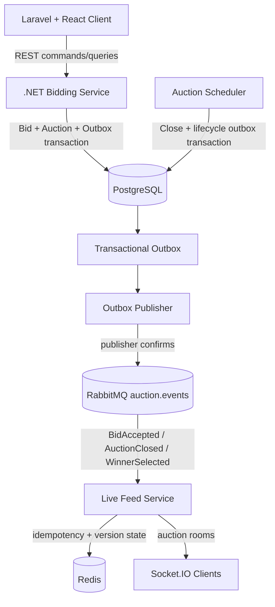

# Distributed Bidding Auction Platform

A functional distributed-system demo for concurrency-safe auction bidding, transactional event delivery, and real-time browser updates.

This repository is a functional architecture demonstration and is not currently intended to be a production-ready auction platform.

## Demo

### Live auction


### Real-time multi-client bidding

Two independent clients stay synchronized through RabbitMQ, Redis, and Socket.IO while the .NET Bidding Service remains authoritative.


### Automatic auction close and winner selection

Auctions close using server-side UTC, with `AuctionClosed` and `WinnerSelected` propagated through the same transactional outbox and messaging pipeline.


## What This Demonstrates

- concurrency-safe bid placement with PostgreSQL-backed optimistic concurrency
- authoritative .NET bidding API and server-side UTC validation
- transactional outbox persistence for committed domain changes
- RabbitMQ at-least-once event delivery with publisher confirms
- idempotent consumers using `eventId`
- `aggregateVersion` ordering and stale-event protection
- same-version lifecycle sibling events, such as `AuctionClosed` and `WinnerSelected`
- Redis-backed Socket.IO fan-out for multiple live-feed instances
- automatic server-authoritative auction closure
- REST reconciliation when live projections are missed
- failure/retry behavior across service boundaries

## Architecture



The Bidding Service owns auction and bid state. PostgreSQL is the source of truth. RabbitMQ, Redis, Socket.IO, and the browser are projections/transport layers, not bidding authorities.

## Key Design Decisions

- **Bidding Service is authoritative:** only the .NET API accepts or rejects bids.
- **Concurrency is database-arbitrated:** `Auction.Version` is an EF Core concurrency token and advances once per accepted bid or closure transition.
- **Outbox prevents lost committed events:** bid/closure state and event intent commit in the same PostgreSQL transaction.
- **RabbitMQ is at-least-once:** publisher confirms reduce false success, but duplicates remain possible after broker confirm and before `PublishedAtUtc` is stored.
- **Consumers dedupe by `eventId`:** Live Feed records processed event IDs in Redis with a demo TTL.
- **`aggregateVersion` protects ordering:** lower versions are stale; newer versions advance the Redis auction version atomically.
- **Same-version sibling events are valid:** `AuctionClosed v16` and `WinnerSelected v16` are distinct events for one aggregate transition.
- **Browser time is UX-only:** server UTC decides bidding and closure validity.
- **REST reconciles missed live events:** Socket.IO keeps clients fresh, but REST remains the authoritative refresh path.

## Quick Start

Prerequisites:

- Git
- Docker Desktop with Docker Compose
- .NET 10 SDK
- PHP 8.3+ and Composer
- Node.js current/LTS and npm

From the repository root:

```powershell
copy .env.example .env
scripts\start-infrastructure.ps1
```

Install/build application dependencies when needed:

```powershell
npm ci --prefix apps/live-feed-service
npm ci --prefix apps/client
composer install --working-dir=apps/client
```

Start the full demo stack in separate PowerShell windows:

```powershell
scripts\start-demo.ps1
```

Open:

- Client: http://localhost:8000/auctions
- Bidding API Swagger: http://localhost:5000/swagger
- Live Feed health: http://localhost:3001/health
- RabbitMQ management: http://localhost:15672

Stop local app/worker processes:

```powershell
scripts\stop-demo.ps1
```

## Demo Reset

For a predictable local demo database:

```powershell
scripts\reset-demo.ps1
```

This deletes and recreates local demo auctions, bids, and outbox rows in the configured development PostgreSQL database. It is not production tooling.

The reset includes:

- Open MacBook Pro auction with current bid 1900, Bob winning, and Alice/Bob bid history for screenshots
- Scheduled Camera auction
- Closed Gaming Console auction with historical bids
- Short Demo Auction for automatic close demonstrations

For a deterministic closed screenshot state with final bid 2100 and Bob as winner:

```powershell
scripts\reset-demo.ps1 -ClosedScreenshot
```

## Quick Demo

1. Run `scripts\start-demo.ps1`.
2. Open `http://localhost:8000/auctions` in two browser windows.
3. Open the MacBook Pro auction in both windows.
4. Choose Alice in one window and Bob in the other.
5. Place a valid Alice bid and watch both clients update through `bid:accepted`.
6. Place a higher Bob bid and watch bid history/current price converge.
7. Open the Short Demo Auction in both windows and wait for expiry.
8. Watch both clients transition to Closed through `auction:closed` and, when a winning bid exists, `winner:selected`.
9. Refresh the page to see REST return the same authoritative closed state.

A more interview-friendly walkthrough lives in [docs/demo-walkthrough.md](docs/demo-walkthrough.md).

## Failure Scenarios

Tested and documented scenarios include concurrent bids, stale bids, RabbitMQ outages, duplicate events, stale aggregate versions, live-feed outage, competing scheduler instances, and bid-after-close rejection.

See [docs/failure-scenarios.md](docs/failure-scenarios.md).

## Tests

Current automated test coverage by component:

| Component | Tests | Coverage focus |
| --- | ---: | --- |
| Bidding Service | 24 | auction queries, bid rules, concurrency, outbox persistence |
| Outbox Publisher | 7 | PostgreSQL claiming, RabbitMQ publishing, confirms, failure/recovery |
| Auction Scheduler | 6 | closure, winner selection, locking, rollback, duplicate-pass prevention |
| Live Feed Service | 7 | RabbitMQ consumption, Redis dedupe/versioning, lifecycle events, DLQ behavior |
| Client | 19 | auction UI, bid form/errors, live bid updates, closed/winner state |

Run all .NET tests from the root solution:

```powershell
dotnet restore
dotnet build
dotnet test
```

Run JavaScript tests:

```powershell
npm test --prefix apps/live-feed-service
npm test --prefix apps/client
```
## Static Analysis

.NET analyzer configuration is centralized in `Directory.Build.props`, `.editorconfig`, and `stylecop.json`. The repository enables built-in .NET/Roslyn analyzers and `StyleCop.Analyzers` for the C# solution.

JavaScript and TypeScript quality gates are centralized through `eslint.config.mjs`, `.prettierrc`, and `.prettierignore`. ESLint uses type-aware TypeScript rules, React and React Hooks rules, JSX accessibility checks, Node.js checks for the live-feed service, and import hygiene. Prettier owns formatting, while `tsc` remains the dedicated type checker.

Production C# files are expected to have the project MIT source header and useful XML summaries for public API surface, domain types, endpoint groups, message contracts, and background services. Test projects keep correctness analyzers enabled, but XML/header documentation noise is relaxed so descriptive test names remain the primary behavior documentation.

Run validation locally with:

```powershell
dotnet build
dotnet test
npm ci
npm run format:check
npm run lint
npm run typecheck
npm run build
npm test
```

## Repository Structure

```text
apps/
  bidding-service/          ASP.NET Core bidding API
  bidding-service.Tests/    PostgreSQL-backed API/domain tests
  client/                   Laravel + React + Vite demo UI
  live-feed-service/        Node.js/TypeScript RabbitMQ + Redis + Socket.IO service
workers/
  auction-scheduler/        .NET worker that closes expired auctions
  auction-scheduler.Tests/  PostgreSQL-backed scheduler tests
  outbox-publisher/         .NET worker that publishes outbox rows to RabbitMQ
  outbox-publisher.Tests/   PostgreSQL/RabbitMQ publisher tests
  billing-worker/           planned placeholder only
  notification-worker/      planned placeholder only
docs/
  architecture.md
  event-catalog.md
  development-plan.md
  demo-walkthrough.md
  failure-scenarios.md
scripts/
  start-infrastructure.ps1
  start-demo.ps1
  stop-demo.ps1
  reset-demo.ps1
```

## Technologies

- .NET 10, ASP.NET Core, EF Core, Npgsql
- PostgreSQL 17
- RabbitMQ 4 management image
- Redis 8 Alpine
- Node.js, TypeScript, Express, Socket.IO, amqplib
- Laravel 13, React 19, Vite, Vitest
- Docker Compose for local infrastructure

## Current Scope

Implemented through Phase 9 hardening:

- functional infrastructure and monorepo foundation
- authoritative bidding API with optimistic concurrency
- transactional outbox for `BidAccepted`, `AuctionClosed`, and `WinnerSelected`
- RabbitMQ outbox publisher with confirms and dev debug queue
- Redis/Socket.IO live feed for bid and lifecycle events
- Laravel/React demo UI with live updates and closed/winner state
- scheduler-driven auction closure
- reviewer-oriented scripts and documentation

Not implemented yet:

- billing worker
- notification worker
- real payment flow
- authentication/account management
- admin auction CRUD
- production deployment/operations hardening

## Production Considerations

This project intentionally leaves production concerns visible rather than pretending they are solved:

- real authentication and authorization
- bidder identity/account integrity
- rate limiting and anti-abuse controls
- payment processing and settlement
- notification delivery
- production secret management
- TLS and service-to-service authentication
- observability, metrics, tracing, and alerting
- persistent Redis strategy and memory policies
- mature retry/backoff policy with `NextAttemptAtUtc`
- schema/event versioning and compatibility policy
- dead-letter review/replay workflows
- deployment orchestration and migrations strategy
- load testing and capacity planning
- security review, audit logging, and compliance requirements

The development outbox publisher currently allows many one-second retry attempts (`MaxPublishAttempts=1000`) so local RabbitMQ outage demos can recover without manual database repair. A production publisher should use backoff and next-attempt scheduling rather than repeated one-second retries.
