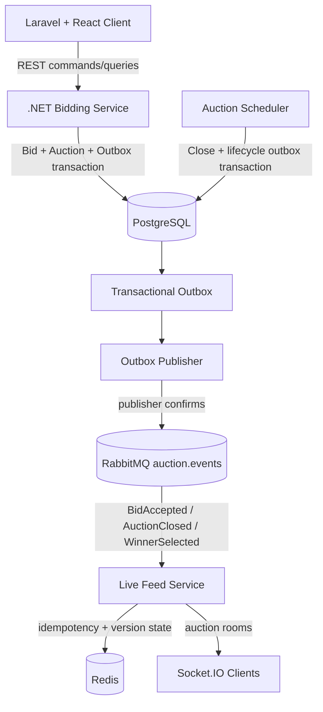

# Distributed Bidding Auction Platform

A functional distributed-system demo for concurrency-safe auction bidding, transactional event delivery, and real-time browser updates.

This repository is a functional architecture demonstration and is not currently intended to be a production-ready auction platform.

## Demo

### Live auction


### Real-time multi-client bidding

Two independent clients stay synchronized through RabbitMQ, Redis, and Socket.IO while the .NET Bidding Service remains authoritative.


### Automatic auction close and winner selection

Auctions close using server-side UTC, with `AuctionClosed` and `WinnerSelected` propagated through the same transactional outbox and messaging pipeline.


## What This Demonstrates

- concurrency-safe bid placement with PostgreSQL-backed optimistic concurrency
- authoritative .NET bidding API and server-side UTC validation
- transactional outbox persistence for committed domain changes
- RabbitMQ at-least-once event delivery with publisher confirms
- idempotent consumers using `eventId`
- `aggregateVersion` ordering and stale-event protection
- same-version lifecycle sibling events, such as `AuctionClosed` and `WinnerSelected`
- Redis-backed Socket.IO fan-out for multiple live-feed instances
- AsyncLocalStorage request/event context for observational correlation tracking
- centralized HTTP errors and idempotent graceful shutdown for the live-feed runtime
- narrow application ports for framework-agnostic live-feed processing
- bounded read-only NDJSON diagnostics streaming with Node backpressure and cancellation
- bounded Worker Thread activity diagnostics for isolated CPU-bound calculations
- bounded libuv thread-pool and child-process runtime diagnostics
- automatic server-authoritative auction closure
- REST reconciliation when live projections are missed
- failure/retry behavior across service boundaries
- Laravel-owned admin, CMS, audit, cache, queue, scheduler, notification preference, and export workflows without taking bidding authority

## Architecture



The Bidding Service owns auction and bid state. PostgreSQL is the source of truth. RabbitMQ, Redis, Socket.IO, and the browser are projections/transport layers, not bidding authorities.

## Key Design Decisions

- **Bidding Service is authoritative:** only the .NET API accepts or rejects bids.
- **Concurrency is database-arbitrated:** `Auction.Version` is an EF Core concurrency token and advances once per accepted bid or closure transition.
- **Outbox prevents lost committed events:** bid/closure state and event intent commit in the same PostgreSQL transaction.
- **RabbitMQ is at-least-once:** publisher confirms reduce false success, but duplicates remain possible after broker confirm and before `PublishedAtUtc` is stored.
- **Consumers dedupe by `eventId`:** Live Feed records processed event IDs in Redis with a demo TTL.
- **`aggregateVersion` protects ordering:** lower versions are stale; newer versions advance the Redis auction version atomically.
- **Same-version sibling events are valid:** `AuctionClosed v16` and `WinnerSelected v16` are distinct events for one aggregate transition.
- **Browser time is UX-only:** server UTC decides bidding and closure validity.
- **REST reconciles missed live events:** Socket.IO keeps clients fresh, but REST remains the authoritative refresh path.

## Quick Start

Prerequisites:

- Git
- Docker Desktop with Docker Compose
- .NET 10 SDK
- PHP 8.3+ and Composer
- Node.js current/LTS and npm
- OpenSSL

From the repository root:

```powershell
Copy-Item .env.example .env
Copy-Item apps/client/.env.example apps/client/.env
dotnet restore
npm ci
npm ci --prefix apps/live-feed-service
npm ci --prefix apps/client
composer install --working-dir=apps/client
php apps/client/artisan key:generate
```

Set `LOCAL_ADMIN_EMAIL`, `LOCAL_ADMIN_PASSWORD`, and optionally `LOCAL_ADMIN_NAME` in
`apps/client/.env`. These are local-only demo credentials and must not be committed.

Generate a fresh RSA key pair for the Laravel-to-Live Feed handoff:

```powershell
scripts\generate-live-feed-admin-keys.ps1
```

The private key is generated at `apps/client/storage/keys/live-feed-admin-private.pem`;
the public key is generated at `apps/live-feed-service/config/live-feed-admin-public.pem`.
Both paths are ignored by Git.

Start local infrastructure. PostgreSQL uses host port `55432` and container port `5432`.

```powershell
scripts\start-infrastructure.ps1
```

Prepare Laravel and Live Feed history:

```powershell
php apps/client/artisan migrate
php apps/client/artisan db:seed --class=Database\\Seeders\\LocalAdminSeeder
npm run migrate:history --prefix apps/live-feed-service
```

This prepares the Laravel database and local administrator. Run `php apps/client/artisan db:seed` for the full demo admin and CMS data. The full client notes are in [docs/client/README.md](docs/client/README.md).
Start the development demo stack in separate PowerShell windows:

```powershell
scripts\start-demo.ps1
```

Open:

- Client: http://localhost:8000/auctions
- Bidding API Swagger: http://localhost:5000/swagger
- Live Feed health: http://localhost:3001/health
- Live Feed runtime diagnostics: http://localhost:3001/diagnostics/runtime
- RabbitMQ management: http://localhost:15672

The committed `.env.example` files are templates only. The root `.env`,
`apps/client/.env`, Laravel `APP_KEY`, RSA keys, dependency directories, and build output
are developer-local or generated files and must not be committed.

Stop local app/worker processes:

```powershell
scripts\stop-demo.ps1
```

## Demo Reset

For a predictable local demo database:

```powershell
scripts\reset-demo.ps1
```

This deletes and recreates local demo auctions, bids, and outbox rows in the configured development PostgreSQL database. It is not production tooling.

The reset includes:

- Open MacBook Pro auction with current bid 1900, Bob winning, and Alice/Bob bid history for screenshots
- Scheduled Camera auction
- Closed Gaming Console auction with historical bids
- Short Demo Auction for automatic close demonstrations

For a deterministic closed screenshot state with final bid 2100 and Bob as winner:

```powershell
scripts\reset-demo.ps1 -ClosedScreenshot
```

## Quick Demo

1. Run `scripts\start-demo.ps1`.
2. Open `http://localhost:8000/auctions` in two browser windows.
3. Open the MacBook Pro auction in both windows.
4. Choose Alice in one window and Bob in the other.
5. Place a valid Alice bid and watch both clients update through `bid:accepted`.
6. Place a higher Bob bid and watch bid history/current price converge.
7. Open the Short Demo Auction in both windows and wait for expiry.
8. Watch both clients transition to Closed through `auction:closed` and, when a winning bid exists, `winner:selected`.
9. Refresh the page to see REST return the same authoritative closed state.

A more interview-friendly walkthrough lives in [docs/demo-walkthrough.md](docs/demo-walkthrough.md).

Client-side admin, CMS, queue, notification, export, and React/Vite architecture notes start at [docs/client/README.md](docs/client/README.md).

## Failure Scenarios

Tested and documented scenarios include concurrent bids, stale bids, RabbitMQ outages, duplicate events, stale aggregate versions, live-feed outage, competing scheduler instances, and bid-after-close rejection.

See [docs/failure-scenarios.md](docs/failure-scenarios.md).

## Tests

Current automated test coverage by component:

| Component | Tests | Coverage focus |
| --- | ---: | --- |
| Bidding Service | 24 | auction queries, bid rules, concurrency, outbox persistence |
| Outbox Publisher | 7 | PostgreSQL claiming, RabbitMQ publishing, confirms, failure/recovery |
| Auction Scheduler | 6 | closure, winner selection, locking, rollback, duplicate-pass prevention |
| Live Feed Service | 7 | RabbitMQ consumption, Redis dedupe/versioning, lifecycle events, DLQ behavior |
| Client | 60 Laravel tests + 32 Vitest tests | admin authorization, CMS, audit/cache/events, queues/scheduled publishing/exports/notifications, React auction/admin/CMS UI |

Run all .NET tests from the root solution:

```powershell
dotnet restore
dotnet build
dotnet test
```

Run JavaScript tests:

```powershell
npm test --prefix apps/live-feed-service
npm test --prefix apps/client
```
## Static Analysis

.NET analyzer configuration is centralized in `Directory.Build.props`, `.editorconfig`, and `stylecop.json`. The repository enables built-in .NET/Roslyn analyzers and `StyleCop.Analyzers` for the C# solution.

JavaScript and TypeScript quality gates are centralized through `eslint.config.mjs`, `.prettierrc`, and `.prettierignore`. ESLint uses type-aware TypeScript rules, React and React Hooks rules, JSX accessibility checks, Node.js checks for the live-feed service, import hygiene, and JSDoc documentation enforcement. Production JS/TS modules require a short responsibility block, and exported/public JS/TS APIs should have useful JSDoc summaries without duplicating TypeScript type annotations. Tests and generated declaration files are excluded from documentation-only rules. Prettier owns formatting, while `tsc` remains the dedicated type checker.

Production C# files are expected to have the project MIT source header and useful XML summaries for public API surface, domain types, endpoint groups, message contracts, and background services. Test projects keep correctness analyzers enabled, but XML/header documentation noise is relaxed so descriptive test names remain the primary behavior documentation.

Run validation locally with:

```powershell
dotnet build
dotnet test
npm ci
npm run format:check
npm run lint
npm run typecheck
npm run build
npm test
```

## Repository Structure

```text
apps/
  bidding-service/          ASP.NET Core bidding API
  bidding-service.Tests/    PostgreSQL-backed API/domain tests
  client/                   Laravel + React + Vite demo UI
  live-feed-service/        Node.js/TypeScript RabbitMQ + Redis + Socket.IO service
    src/application/       composition and event processing
    src/domain/            event contracts and validation
    src/infrastructure/    Redis, RabbitMQ, and runtime integrations
    src/transport/         Socket.IO transport helpers
    scripts/               development-only utilities
    tests/                 integration and runtime unit tests
workers/
  auction-scheduler/        .NET worker that closes expired auctions
  auction-scheduler.Tests/  PostgreSQL-backed scheduler tests
  outbox-publisher/         .NET worker that publishes outbox rows to RabbitMQ
  outbox-publisher.Tests/   PostgreSQL/RabbitMQ publisher tests
  billing-worker/           planned placeholder only
  notification-worker/      planned placeholder only
docs/
  architecture.md
  event-catalog.md
  development-plan.md
  demo-walkthrough.md
  failure-scenarios.md
scripts/
  start-infrastructure.ps1
  start-demo.ps1
  stop-demo.ps1
  reset-demo.ps1
```

## Technologies

- .NET 10, ASP.NET Core, EF Core, Npgsql
- PostgreSQL 17
- RabbitMQ 4 management image
- Redis 8 Alpine
- Node.js, TypeScript, Express, Socket.IO, amqplib
- Laravel 13, React 19, Vite, Vitest
- Docker Compose for local infrastructure

## Current Scope

Implemented through the final Laravel/React client expansion audit:

- functional infrastructure and monorepo foundation
- authoritative bidding API with optimistic concurrency
- transactional outbox for `BidAccepted`, `AuctionClosed`, and `WinnerSelected`
- RabbitMQ outbox publisher with confirms and dev debug queue
- Redis/Socket.IO live feed for bid and lifecycle events
- Laravel/React demo UI with live updates and closed/winner state
- scheduler-driven auction closure
- reviewer-oriented scripts and documentation

Not implemented yet:

- billing worker
- notification worker
- real payment flow
- authentication/account management
- admin auction CRUD
- production deployment/operations hardening

## Production Considerations

This project intentionally leaves production concerns visible rather than pretending they are solved:

- real authentication and authorization
- bidder identity/account integrity
- rate limiting and anti-abuse controls
- payment processing and settlement
- notification delivery
- production secret management
- TLS and service-to-service authentication
- observability, metrics, tracing, and alerting
- persistent Redis strategy and memory policies
- mature retry/backoff policy with `NextAttemptAtUtc`
- schema/event versioning and compatibility policy
- dead-letter review/replay workflows
- deployment orchestration and migrations strategy
- load testing and capacity planning
- security review, audit logging, and compliance requirements

The development outbox publisher currently allows many one-second retry attempts (`MaxPublishAttempts=1000`) so local RabbitMQ outage demos can recover without manual database repair. A production publisher should use backoff and next-attempt scheduling rather than repeated one-second retries.

### Live Feed Node Phase 8 Operations Admin Page

The Node live-feed service now includes a protected, read-only operations page at `GET /admin/live-feed`. It renders a small server-side React shell, hydrates it in the browser, and subscribes to a dedicated Socket.IO admin channel for bounded operational activity updates. The page reuses the existing runtime diagnostics, process metrics, health/status information, and Phase 6/7 diagnostics without creating a second auction or reporting system.

Laravel owns admin users and password hashing. An authenticated Laravel administrator receives a short-lived RS256 token, and the Node live-feed service verifies it with a public key before establishing a short-lived signed, HttpOnly, SameSite cookie session. The token is exchanged in a form handoff or Authorization header; it is not stored in localStorage or a URL. Node does not maintain admin usernames/passwords. The cookie uses `Path=/` so the authenticated `/socket.io` handshake receives it, while HTTP routes and admin Socket.IO access remain server-side authorized. This is a portfolio/demo admin boundary, not a replacement for production SSO, CSRF, rate limiting, centralized secret management, or immediate token revocation.

Recent activity is kept in a fixed-size in-memory buffer for operational visibility only. It is not an event store, audit log, source of truth, or durable history. The Bidding Service remains authoritative, and the page cannot accept bids, change auction state, mutate Redis projections, publish RabbitMQ messages, or alter existing Socket.IO auction events.

### Live Feed Node Phase 9 durable operational history

Phase 9 adds an optional PostgreSQL-backed, read-only operational history for the protected admin page. The live-feed service records bounded event metadata such as event ID, auction ID, event type, aggregate version, correlation ID, processing time, and outcome. It never stores raw event payloads and it is not an authoritative auction log.

The history store is best-effort. A configured pool is created with `LIVE_FEED_DATABASE_URL`; without that setting, the service remains available and reports history as unconfigured. Insert failures are isolated from event processing: Redis projection, Socket.IO emission, RabbitMQ ACK/NACK behavior, and stale-version handling continue exactly as before. Duplicate event IDs are idempotent through a database uniqueness constraint and `ON CONFLICT DO NOTHING`.

Apply the idempotent migration with `npm run migrate:history` from `apps/live-feed-service`. The admin page queries `GET /admin/api/history` with bounded filters and can request `GET /admin/api/history.pdf` for a selected range. Dates are explicit UTC values at the API boundary, ranges are limited to 31 days, and results are bounded. PDF output contains safe summary columns only. The database pool is closed by the existing graceful shutdown coordinator.

The Phase 8 in-memory recent-activity buffer remains a fast, bounded live snapshot; PostgreSQL history is a separate durable diagnostic read path. Neither is used to decide auction correctness. The Bidding Service remains authoritative, and the existing live-feed event contracts, RabbitMQ topology, Redis semantics, Socket.IO auction channel, and HTTP contracts remain unchanged.

### Laravel-owned Live Feed administrator authentication

The Laravel client is the identity authority: its `users` table, standard password hashing, and `access-admin` gate determine who may open Live Feed Operations. Laravel signs a short-lived RS256 token with a private key kept outside Git. Node receives only the public verification key, validates issuer, audience, expiry, signature, and admin permission, then creates its bounded HttpOnly session for `/admin/live-feed`, history, PDF, and the `admin:live-feed` Socket.IO room. The token is not kept in localStorage or a URL. Generate local keys with `openssl genpkey -algorithm RSA -pkeyopt rsa_keygen_bits:2048 -out apps/client/storage/keys/live-feed-admin-private.pem` and `openssl rsa -pubout -in apps/client/storage/keys/live-feed-admin-private.pem -out apps/live-feed-service/config/live-feed-admin-public.pem`; both paths are ignored. The Node session is local and short-lived, so this phase does not claim immediate centralized revocation.
