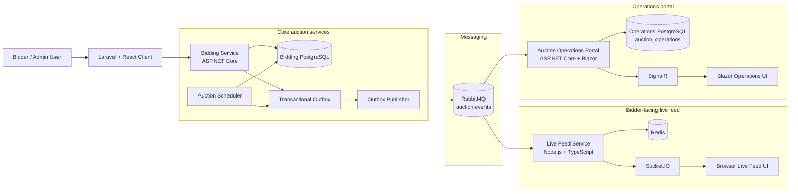
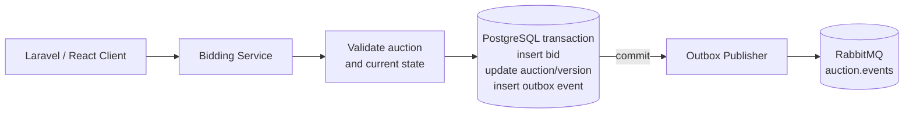
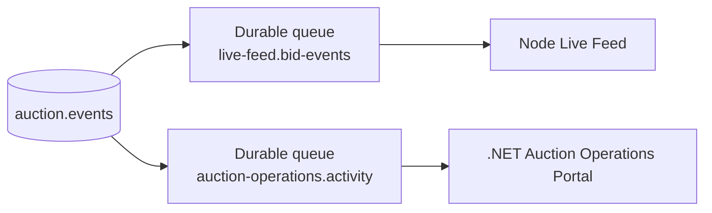
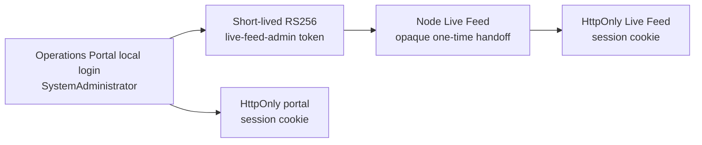

# Architecture

This project demonstrates a distributed bidding architecture with clear service boundaries. It is intentionally functional and educational before it is production hardened.

## System overview

The repository-level [README](../README.md) is the concise overview. The completed platform has two independent event consumers and two PostgreSQL ownership boundaries:

The finalized identity, ownership, isolation, deployment, and future split rules
are maintained in the [multi-tenancy architecture reference](multi-tenancy.md).



The Bidding Service remains authoritative for bids, auctions, and `Auction.Version`. The portal records a safe activity projection in `auction_activity`; it never updates bidding tables. Its `/activity/live`, `/activity/history`, and `/activity/report.pdf` features use PostgreSQL, while SignalR is only best-effort delivery. Laravel owns bidder and tenant-admin identity; the Operations Portal owns independent SystemAdministrator identity.

## Accepted-bid transaction flow



Optimistic concurrency retry remains inside the Bidding Service. An accepted bid advances the aggregate version exactly once; a rejected bid does not mutate it. The outbox event is committed atomically with the authoritative state change.

## RabbitMQ fan-out



The queues are independent, so one consumer cannot steal messages from the other. Delivery is at least once and the portal deduplicates by `EventId`; `AggregateVersion` is observational metadata, so `AuctionClosed`, `WinnerSelected`, and `AuctionPurchased` may share a version.

## Authentication handoff



The Operations Portal retains the system-admin private key. Node validates with public verification material and the service-specific `live-feed-admin` audience. The portal validates the authenticated local SystemAdministrator session before issuing the short-lived token; Live Feed validates issuer, audience, `kid`, permission, role, expiry, and single-use JTI before returning the opaque browser handoff.


## Completed operations portal boundary

The portal consumes the existing `auction.events` exchange through its own durable `auction-operations.activity` queue, with bindings for `auction.bid.accepted`, `auction.closed`, `auction.winner.selected`, and `auction.purchased`. Its database has an EventId uniqueness constraint, so duplicate delivery is acknowledged without duplicating rows or live notifications. `AuctionClosed`, `WinnerSelected`, and `AuctionPurchased` can share an aggregate version because EventId, not version, identifies an event. Operations visibility labels `AuctionPurchased` as a Buy Now purchase and displays the producer-supplied fixed amount, purchaser, Tenant, and version without inferring or mutating domain state.

The portal’s history query is UTC-based, bounded to a 31-day range, filtered by exact aggregate ID and known event type, and paginated in PostgreSQL. Reports use the same filters and reject more than 5,000 rows. OpenTelemetry, bounded metrics, PostgreSQL/RabbitMQ health checks, and an isolated BenchmarkDotNet project are documented in the [portal README](../apps/auction-operations-portal/README.md).


## Client Application

The Laravel client is the browser-facing web shell. React renders the demo auction list and auction detail routes, calls same-origin Laravel BFF read routes for tenant-scoped public auction reads, sends ordinary bids and explicit Buy Now commands through Laravel's authenticated BFF, and subscribes to the Live Feed Service for `bid:accepted`, `auction:purchased`, `auction:closed`, and `winner:selected` projections. SaleMode controls rendered actions; the client preserves ordinary CurrentBid* separately from terminal Final* state.

The client never decides whether a bid is valid. It submits commands to the Bidding Service, handles structured REST responses, and updates local UI state from accepted command responses. Socket.IO events are used for multi-browser convergence and live awareness.

Client-side version checks protect the view from stale live events. Lower versions are ignored. `BidAccepted` must advance the current version, while distinct lifecycle sibling events at the same version are allowed because one transition may produce `AuctionClosed`, `WinnerSelected`, and `AuctionPurchased`. This improves UI resilience but does not make browser state authoritative.

Browser countdowns are visual only. Server-side UTC validation in the Bidding Service remains the source of truth for scheduled, open, and closed auction behavior.

### Authentication boundary hardening

Human command identity is established by the Laravel session and conveyed to the Bidding Service only through a short-lived, server-issued RS256 bearer token. Laravel keeps the private signing key; the Bidding Service validates the signature, configured `kid`, issuer, audience, lifetime, and permission claims using public verification material. `sub` is the actor identity, while permissions are derived from trusted Laravel user state. Browsers do not receive or store these downstream tokens, and CSRF protects browser-to-Laravel state changes.

Public auction reads use a server-side tenant-bound read token, while public Socket.IO auction events remain anonymous. All human state-changing commands use the Laravel BFF; the Bidding Service remains the final policy boundary (`AuctionBid`, `AuctionBuy`, and `AuctionManage`). Tenant context is carried without overloading `sub`. System-administration and live-feed-admin authentication remain separate SYS0+ work.

### MT1 tenant persistence foundation

The Bidding Service now owns a `tenants` registry with an opaque UUID, display name, explicit `Active`/`Suspended`/`Disabled` status, and UTC timestamps. `Auction.TenantId` is persisted as the authoritative ownership field. Existing demo auctions are backfilled to the deterministic `Local Demo Tenant` (`aaaaaaaa-1111-4111-8111-111111111111`), and new single-tenant compatibility API creations use that server-controlled default.

MT2 bound Laravel users to the server-configured installation tenant and added `tenant_id` to Laravel-issued Bidding Service tokens. MT3 added tenant isolation for authenticated mutations; MT4 adds tenant-scoped public reads, tenant-bearing events, and tenant-aware Live Feed/portal projections. MT6.1 enforces the persisted tenant status at the Bidding Service tenant-facing boundary: `Active` permits normal reads and mutations, `Suspended` permits reads but denies mutations, and `Disabled` denies tenant-facing access while retaining data for global monitoring. MT5.1 adds the ClientApplication registry foundation; MT5.2 adds public-key credential persistence and internal lifecycle tooling, while request admission, provisioning UI, and WordPress integration remain separate concerns.

MT6.2a adds a separate authenticated service-to-service decision boundary for Live Feed. Live Feed signs a short-lived RS256 service token (`sub=live-feed-service`) and calls `POST /internal/live-feed/access` with an `auctionId`. Bidding validates the dedicated service identity, resolves `Auction -> Tenant -> TenantStatus` from authoritative PostgreSQL state, and returns only an allow/deny decision: `Active` and `Suspended` are allowed, while `Disabled`, missing targets, and dependency failures are denied or fail closed. Live Feed does not receive Bidding database credentials, and TenantStatus is not placed in browser payloads, JWTs, Redis, or event contracts.

MT6.2b applies that trusted decision before a public Socket.IO auction-room join. Every `auction:subscribe` request validates its `auctionId`, asks Bidding for a fresh decision, and calls `socket.join` only for an allowed result; denied, missing, unauthorized, unavailable, timed-out, and network-failed decisions do not join. Suspended tenants remain readable through Live Feed, while Disabled tenants cannot newly join. Reconnect and later subscription requests are rechecked. Admin-room admission and unsubscribe remain separate, and Live Feed continues to use Redis only for its non-authoritative projection and event state.

MT6.3a establishes the authoritative tenant lifecycle mutation boundary. A `SystemAdministrator` holding the dedicated `bidding-service-admin` audience and `system.tenant.status` permission may call `PATCH /api/system/tenants/{tenantId}/status` with a target status and `expectedVersion`. Bidding validates that optimistic-concurrency version, changes the persisted tenant state only for an actual transition, increments the tenant's monotonic `Version`, and inserts `TenantStatusChanged` into the PostgreSQL outbox in the same EF transaction. The event carries its immutable event ID, prior/current status, new tenant version, and UTC occurrence time; it routes as `tenant.status.changed`. RabbitMQ delivery is eventual: a broker outage leaves the committed status and durable outbox row intact, so MT6.1 HTTP checks and MT6.2b new-room admission reflect the database immediately. Existing Live Feed room memberships are not consumed or revoked in MT6.3a; that future consumer remains deferred.

MT6.3 consumes `TenantStatusChanged` in Live Feed for admission revocation. The consumer validates the Bidding-owned event, atomically accepts only a higher per-tenant `tenantVersion` in Redis, and evicts public `tenant:{tenantId}:auction:{auctionId}` room memberships only for an accepted `Disabled` transition. Duplicate and stale events are ACKed without repeating eviction; Redis or Socket.IO failures are retried through the existing RabbitMQ NACK path. This is admission revocation only: already-connected sockets are removed from affected rooms, but the transport remains connected, no polling or per-event Bidding lookup is introduced, and future subscription admission remains governed by the MT6.2a decision boundary.

MT6.4 adds the protected Operations Portal `/admin/tenants` page as a thin
SystemAdministrator client of Bidding's existing tenant administration API.
The page reads the authoritative tenant name, status, version, and UTC update
time, confirms transitions, and sends `expectedVersion`; it never mutates the
Bidding database directly. Bidding remains the only status-transition
authority, including its optimistic-concurrency and transactional-outbox
semantics. A stale version produces a visible conflict and authoritative
refresh without automatic retry. The page performs no polling or optimistic
status update, and does not change Live Feed revocation behavior.

### MT3 authenticated tenant resource enforcement

Authenticated Bidding Service mutations now require the canonical signed
`tenant_id` claim. Auction creation verifies that the claimed tenant exists and
assigns ownership from that claim; update, delete, cancel, bid, and Buy Now use
tenant-scoped lookups and return 404 when the resource belongs to another
tenant. Existing permission policies remain separate and are still required.

MT3 did not scope public reads. MT4 now scopes them through Laravel's trusted
read token and filters Bidding Service queries by `Auction.TenantId`; public
Socket.IO remains anonymous but is routed through tenant-aware rooms.

### MT2 trusted Laravel tenant context

Each Laravel installation represents exactly one tenant selected by the
server-side `TENANT_ID` configuration. Local/testing may use the deterministic
demo tenant `aaaaaaaa-1111-4111-8111-111111111111`; non-local deployments must
provide a valid UUID explicitly. Laravel users persist that tenant ID, and the
token issuer refuses to mint a Bidding Service token when a user's tenant does
not match the installation context. The browser cannot override this value.

The signed token claim is `tenant_id`, alongside the existing human `sub` and
role/permission claims. `tenant_id` is not a client/application identity:
`client_id` application admission is layered separately from the human token;
`azp` is not added to human tokens. Bidding Service
continues its MT1 server-controlled demo-tenant compatibility behavior for
legacy internal flows. System admin tokens remain tenant-neutral.

### MT4 tenant-scoped reads and event projections

Public reads now use a short-lived server-issued `auction.read` token. The
Bidding Service filters list, detail, and bid-history reads by the trusted
`tenant_id`; the browser never supplies tenant authority. Integration event
payloads carry the authoritative auction `tenantId`. Live Feed validates that
UUID, stores tenant-aware Redis projections/history, and publishes public
updates to `tenant:{tenantId}:auction:{auctionId}` rooms. The Operations Portal
persists `tenant_id` on activity records and backfills existing activity to the
local demo tenant. Tenant runtime status is enforced by the Bidding Service for
tenant-facing HTTP routes. Live Feed's public auction Socket.IO subscription
remains browser-anonymous, but each room admission now calls the trusted
Bidding decision boundary before joining. The Node service still has no direct
Bidding database access; system-admin Live Feed channels remain independently
authenticated.

Tenant status is read from the authoritative `tenants` row after bearer and
client-application tenant binding. It is deliberately not copied into JWT or
client-assertion claims, so status changes take effect without waiting for
token expiry. `SystemAdministrator` and scheduler operations remain separate
from tenant-user runtime status enforcement.

MT6.2b applies the decision port before `socket.join` and rechecks every new
subscription, including client-triggered reconnect subscriptions. MT6.3
consumes the authoritative `TenantStatusChanged` event and removes public
auction-room memberships after an accepted `Disabled` transition. This is not
forced transport disconnect: the socket remains connected, and future
real-time lease/revalidation designs remain a later phase.

### MT5.1 ClientApplication registry foundation

The Bidding Service owns a `client_applications` registry with a stable,
globally unique `client_id`, immutable `TenantId`, display name, explicit
`Active`/`Disabled`/`Revoked` status, and UTC timestamps. A tenant may own many
registered applications, such as Laravel and a future WordPress client. The
local demo seeds `local-laravel-client` (application ID
`aaaaaaaa-7777-4777-8777-777777777777`) for the deterministic demo tenant.

`client_id` is application identity, not a tenant ID, human `sub`, secret, or
credential. MT5.1 does not add credentials, client JWT claims, admission
enforcement, provisioning UI, or public self-registration. Client status is
stored but not enforced; those concerns belong to later MT5 phases.

The intended provisioning flow is administrative: identify a tenant and
register an application with a stable `client_id`. The local demo seeds
`local-laravel-client`, but does not seed a credential or add a Laravel
`BIDDING_SERVICE_CLIENT_ID` setting because no runtime component consumes
application identity yet.

### MT5.2 ClientCredential persistence and lifecycle foundation

Each `ClientApplication` may own multiple `ClientCredential` records so key
rotation can overlap. A credential stores only canonical RSA SubjectPublicKeyInfo
PEM, a globally unique `kid`, a SHA-256 public-key fingerprint, validity dates,
and `Active`/`Revoked` lifecycle state. RSA keys must be at least 2048 bits;
private keys, passphrases, shared secrets, and other credential material never
enter the Bidding Service database. Expiry is derived from `ExpiresAtUtc`, while
revocation is explicit and preserves the row for audit.

The internal `IClientCredentialProvisioningService` resolves applications by
`client_id`, accepts operator/client-generated public PEM, permits preparation
against a disabled application, rejects new credentials for a revoked
application, and supports idempotent revocation by `kid`. It is not an HTTP
endpoint and is not used by the current request pipeline. Registration and a
credential row grant no runtime trust: MT5.3 must add client proof and admission
separately. For rotation, provision the new public key, deploy the client-held
private key, verify the future admission path, then revoke the old credential.
The local/test suite generates ephemeral keys; no private key is seeded or
committed.

### MT5.3a client assertion validation foundation

The Bidding Service contains an internal reusable validator for signed client
assertions. It accepts only RS256 JWTs with a required `kid`, resolves `iss` to
a registered `ClientApplication`, verifies that the selected credential belongs
to that application and is currently usable, checks the signature with the
stored RSA public key, enforces the `dbap-bidding-service` audience and short
bounded lifetime, and cross-checks signed `tenant_id` against the application's
authoritative `TenantId`. It returns a typed application identity without raw
key material.

This is a validation boundary only. HTTP request admission is not enabled and
Laravel does not issue client assertions. MT5.3b adds a reusable replay
protector after cryptographic validation: it atomically records a hashed,
application-scoped JTI with Redis `SET NX` and a TTL covering the assertion's
remaining acceptance window. Redis failure fails closed, no process-local
fallback is used, and the raw assertion is never stored. Replay protection is
still not wired into HTTP admission; Laravel assertion issuance remains a later
phase.

### MT5.3c Laravel client assertion issuance

Laravel can optionally issue a fresh RS256 client assertion for each outbound
Bidding Service request when `BIDDING_SERVICE_CLIENT_ASSERTION_ENABLED=true`.
The server-only configuration identifies `local-laravel-client` (or the
operator's registered `ClientApplication`), selects its credential with
`BIDDING_SERVICE_CLIENT_KEY_ID`, and reads the RSA private key from a mounted
file path. The private key is never stored in Laravel or exposed to the
browser. Assertions use `iss = client_id`, the installation `tenant_id`, a
fresh UUID JTI, `nbf = iat`, the `dbap-bidding-service` audience, and a 30-second
TTL. They are sent in `X-Client-Assertion` alongside the existing human
`Authorization` bearer token.

The flag defaults to disabled so existing calls remain compatible. When
enabled, missing or invalid configuration fails the outbound request closed;
the client never silently sends a request without the assertion. Assertions
are generated per request, and Laravel must be restarted/reloaded after key
or KeyId rotation if the deployment changes its mounted configuration.

MT5.4 adds an operator-only bootstrap boundary for this deployment workflow.
The internal `provision`/`revoke` command runs from the Bidding Service
executable and resolves the authoritative `ClientApplication` by `client_id`.
It accepts only an operator-supplied public SubjectPublicKeyInfo PEM, reuses
`IClientCredentialProvisioningService`, and prints non-secret credential
metadata. It is not an HTTP endpoint, has no browser or Operations Portal
surface, and never reads or stores the Laravel private key. The rollout
runbook is in `docs/runbooks/client-assertion-rollout.md`.

The bootstrap sequence is: generate the keypair on the Laravel/client side,
provision the public key, mount the private key and configure Laravel, smoke
test with admission disabled, then enable the deployment-only
`ClientAssertionAdmission__Enabled=true` override. Rotation provisions the new
public credential before switching Laravel to the new private key and `KeyId`;
the old credential remains available until the overlap is verified and is then
revoked. Both Laravel issuance and Bidding Service admission remain false by
default in this phase.
### MT5.3d runtime client admission

The Bidding Service now has a temporary `ClientAssertionAdmission:Enabled`
rollout gate, defaulting to `false`. When enabled, the `/api/auctions`
tenant-facing route group requires one `X-Client-Assertion` header. The
existing `IClientAssertionAuthenticator` performs cryptographic validation and
one-time JTI consumption exactly once per request; the resulting application
identity is kept in a typed request context. The assertion tenant must agree
with the already authenticated bearer/read-token `tenant_id` before the
endpoint runs. Existing bearer authentication, permissions, and resource
`TenantId` predicates remain required, so client proof grants no human or
operation permissions.

Missing, malformed, invalid, or replayed assertions return generic `401`;
tenant identity disagreement returns `403`; replay-store unavailability
returns `503`. `/health`, system-administration surfaces, workers, and Live
Feed are outside this application-admission boundary. Disabled mode preserves
legacy behavior and is a migration gate only: after deployment credentials are
provisioned and Laravel issuance is enabled, the gate should be enabled,
validated, and removed or made mandatory rather than retained as a permanent
bypass.

Correlation IDs are tracing metadata only. The Bidding Service bounds incoming correlation values and replaces empty, oversized, or control-character values with a generated identifier; they never participate in authentication or authorization decisions.
## Bidding Service Authority

The Bidding Service is authoritative for:

- accepting or rejecting bids
- auction bid state
- minimum bid validation
- auction open/closed validation
- bid ordering and versioning

Other services must not independently decide whether a bid is valid. PostgreSQL state owned by the Bidding Service is the authority for accepted bid history, current auction state, and durable event intent.

## Concurrency-Safe Bidding

`Auction.Version` is configured as an EF Core optimistic concurrency token and is monotonic. Every accepted bid advances the auction version exactly once; rejected bids and failed concurrency attempts do not advance it.

Bid placement uses a bounded retry strategy. Each attempt re-reads the auction row, validates the bid against server UTC and current PostgreSQL state, inserts one bid row, updates the auction current bid fields, increments the version, creates one outbox message, and commits in a single database transaction.

If another transaction updates the same auction first, EF Core detects the stale version through the database update condition. The service rolls back, clears tracked state, re-reads the current auction, and re-runs all bid rules. A bid that became stale after another accepted bid receives the normal minimum-bid error. A bid that continues to encounter write conflicts after the bounded retry limit receives a clear concurrency-conflict response.

PostgreSQL arbitrates writes, the Bidding Service remains authoritative, and retries are bounded to avoid unbounded request time.

## Transactional Outbox

Direct RabbitMQ publishing inside the bid request is intentionally avoided because the database commit and broker publish cannot be made atomic without another durability mechanism. Publishing directly could leave a committed bid without a message, or a message for a bid that later rolls back.

The outbox records event intent in the same PostgreSQL transaction as the accepted business change:

```text
POST bid
|
v
Bidding Service
|
v
PostgreSQL transaction
|
+-- Bid
+-- Auction
+-- OutboxMessage
|
COMMIT
```

Phase 3 persists only `BidAccepted` outbox messages. Rejected bids do not create integration events yet. Each outbox row stores an explicit JSON payload as `jsonb`, plus event metadata such as event type, aggregate ID, aggregate version, occurrence time, correlation ID, and publication state.

`AggregateVersion` equals the resulting `Auction.Version`. Later publishers and consumers can use this value for event ordering and stale-event detection. `CorrelationId` comes from `X-Correlation-ID` when provided, otherwise the API generates one; it is included in logs, response headers/body, and outbox rows.

The outbox publisher runs as a separate .NET worker in `workers/outbox-publisher`. It polls unpublished messages, claims batches with PostgreSQL `FOR UPDATE SKIP LOCKED`, publishes to RabbitMQ, waits for publisher confirmation, and then marks rows as published.

The publisher uses the durable topic exchange `auction.events`. `BidAccepted` is routed with `auction.bid.accepted`. A development-only debug queue, `auction.events.debug`, can be declared and bound with `auction.#` to inspect messages locally.

If RabbitMQ is unavailable, bid requests still commit because they only write PostgreSQL state and outbox rows. The publisher records concise publish errors, increments `PublishAttempts`, leaves `PublishedAtUtc` null, and retries on later polls.

Publisher confirms reduce the chance of marking undelivered messages as published, but they do not provide exactly-once delivery. A process can crash after RabbitMQ accepts a message and before PostgreSQL is updated. Consumers must therefore assume at-least-once delivery and use `eventId` for idempotency.
## Auction Scheduler

The Auction Scheduler is a separate .NET worker, independent of the HTTP API. It uses server-side UTC only and closes auctions where `Status = Open` and `EndTimeUtc <= current UTC`. Scheduled auctions that have not opened, cancelled auctions, and already closed auctions are ignored in this phase.

Each closure is committed in one PostgreSQL transaction. The scheduler re-reads and locks an eligible auction with `FOR UPDATE SKIP LOCKED`, verifies it is still open and expired, determines the winner from authoritative accepted bid state, sets `Auction.Status = Closed`, increments `Auction.Version` exactly once, and inserts lifecycle outbox rows. It never publishes directly to RabbitMQ.

```text
Auction Scheduler
|
v
PostgreSQL
|
+-- Auction close
+-- AuctionClosed outbox
+-- WinnerSelected outbox, when a winning bid exists
|
v
Outbox Publisher
|
v
RabbitMQ
```

Multiple scheduler instances are safe at the row-claiming level because locked rows are skipped by competitors. The version check remains in the update condition so the database still arbitrates stale state.

For a bid-versus-close race, PostgreSQL transaction ordering decides the serialized outcome. If a bid commits before the scheduler locks and closes the auction, the scheduler observes that accepted bid and can select it as winner. If the scheduler closes first, later bid placement re-reads the authoritative closed state or hits a concurrency conflict and is rejected by normal bid rules. No browser time participates.

`AuctionClosed` and `WinnerSelected` from the same close workflow use the same resulting `Auction.Version` and correlation ID. If an auction has no accepted bids, the scheduler emits `AuctionClosed` only.

## Live Feed Service

The Live Feed Service never decides whether a bid is valid. It only broadcasts accepted events that originated from the authoritative Bidding Service and arrived through RabbitMQ.

It consumes from one durable shared queue, `live-feed.bid-events`, bound to `auction.events` with the auction routing keys and `tenant.status.changed`. Manual acknowledgement is used: valid messages are ACKed after validation, Redis idempotency/order checks, and Socket.IO fan-out or tenant-room eviction. Malformed messages are NACKed without requeue and dead-lettered to `live-feed.bid-events.dlq`; transient processing failures are NACKed with requeue.

Redis supports live-feed behavior, not auction authority. It powers the Socket.IO Redis adapter for multi-instance fan-out, stores short-lived event idempotency keys by `eventId`, stores the highest observed `aggregateVersion` per auction, and stores the highest accepted tenant status version for revocation ordering. These version updates are atomic in Redis so competing live-feed instances do not race through a naive read-then-write path.

The service ignores duplicate event IDs and stale lower-version observations. `eventId` provides event uniqueness; `aggregateVersion` represents the resulting aggregate state version. Because one aggregate transition can produce multiple events, a new `AuctionClosed v16`, `WinnerSelected v16`, or `AuctionPurchased v16` is accepted when its event ID is new. Buy Now threshold transitions can additionally include `BidAccepted v16`; all same-version companions are merged atomically, and once `AuctionPurchased` establishes the terminal winner and final price, later same-version close/selection companions cannot overwrite them. If an event advances from version 42 to 44, the service accepts and broadcasts the newer authoritative state while logging the gap; it does not fabricate missing events or run a replay engine in this demo phase.

Socket.IO rooms are constructed server-side as `tenant:{tenantId}:auction:{auctionId}` after validating that the client supplied a syntactically valid UUID and resolving the tenant from the authoritative projection. The frontend-facing events are `bid:accepted`, `auction:closed`, `winner:selected`, and `auction:purchased`; a disabled-tenant eviction may emit the generic `auction:subscription-revoked` notification before leaving the room. The purchase event exposes the buyer, authoritative final price, aggregate version, purchase time, and correlation ID; broker metadata stays internal.
### Live Feed Node Phase 1 structure and runtime diagnostics

The Node live-feed source is organized by its current responsibilities rather than by speculative abstractions:

```text
apps/live-feed-service/
  src/
    application/                 composition and event processing
    config/                      environment-backed configuration
    domain/                      event contracts and validation
    infrastructure/cache/        Redis state integration
    infrastructure/messaging/    RabbitMQ integration
    infrastructure/runtime/      event-loop and process diagnostics
    transport/websocket/         Socket.IO room/subscription helpers
    index.ts                     executable bootstrap
  scripts/                       development-only Socket.IO observer
  tests/integration/             RabbitMQ/Redis live-feed behavior tests
  tests/unit/                    runtime diagnostic tests
```

`GET /diagnostics/runtime` is a read-only, observational endpoint. It reports Node version, process uptime, selected `process.memoryUsage()` categories (`rss`, `heapTotal`, `heapUsed`, `external`, and `arrayBuffers`, all in bytes), event-loop utilization, and event-loop delay percentiles normalized from nanoseconds to milliseconds. It does not read or modify auction state, Redis state, RabbitMQ messages, or Socket.IO rooms. `/health` remains unchanged.

Node JavaScript runs primarily on the event-loop thread. Async I/O allows the process to await external work, but JavaScript execution itself is not automatically multithreaded. Event-loop delay indicates blocked or overloaded JavaScript execution; CPU-heavy work must not block that thread. Worker Threads are used only by the later Phase 6 bounded diagnostic activity calculation, not by the auction path. Cluster, Child Processes, streaming exports, SSR, PostgreSQL, and BFF behavior remain outside this phase.

The runtime monitor starts and stops explicitly with the service, has no import-time side effects, and does not continuously log or poll. V8/process memory categories are diagnostic observations only. The Bidding Service remains authoritative for bid acceptance/rejection, auction state, lifecycle transitions, and aggregate-version assignment; the Node service remains a downstream RabbitMQ/Redis/Socket.IO projection and fan-out service.

### Live Feed Node Phase 2 asynchronous context tracking

The live-feed service uses Node's built-in `AsyncLocalStorage` to attach observational metadata to one HTTP request or RabbitMQ delivery without manually threading correlation fields through every asynchronous method. The context may contain `requestId`, `correlationId`, `eventId`, and `auctionId`.

HTTP requests are scoped in Express middleware. An incoming `x-correlation-id` is preserved, and an optional `x-request-id` is tracked when supplied; no competing request-ID generator is introduced. The existing `/health` contract is unchanged. The runtime diagnostics response may include the safe, additive `requestContext` fields.

RabbitMQ deliveries are scoped after parsing the existing event envelope:

```text
RabbitMQ Event
↓
AsyncLocalStorage context
↓
Processor
↓
Redis
↓
Socket.IO
```

AsyncLocalStorage context propagates through Promise/await continuations and standard asynchronous resources. Each request or message receives an isolated scope, so concurrent operations cannot cross-contaminate correlation metadata. Missing or malformed correlation metadata produces an empty/partial observational context and never changes validation, Redis acceptance, ACK/NACK, retry, DLQ, ordering, or client output behavior.

Context is not application state and is never used as a source of auction correctness. The Bidding Service remains authoritative, and event contracts remain unchanged. Existing direct console logging was intentionally not redesigned in this phase; `getContext()` is available for a later focused logging integration.
### Live Feed Node Phase 3 failure handling and graceful shutdown

The live-feed service classifies client-safe boundary failures with a small `ApplicationError` model and maps them through one Express error handler. Successful responses, including `/health` and `/diagnostics/runtime`, remain unchanged. Unknown failures receive a generic 500 response without internal causes, stack traces, credentials, or connection strings.

Startup and shutdown are coordinated explicitly. If startup fails after resources have been created, the same cleanup path is run before the original failure is rethrown. For ordinary `SIGTERM` or `SIGINT`, the service runs one idempotent shutdown coordinator:

```text
SIGTERM / SIGINT
↓
shutdown coordinator
↓
cancel RabbitMQ consumer and await in-flight handlers
↓
close Socket.IO / HTTP
↓
close Redis clients
↓
stop event-loop monitoring
```

RabbitMQ cancellation stops new deliveries where the client permits it; already-delivered messages retain their existing processing and ACK/NACK behavior. Cleanup steps continue in order if an already-closing dependency reports an error, and repeated shutdown calls share one completion promise.

`unhandledRejection` and `uncaughtException` are treated as fatal process conditions. The lifecycle manager records a concise diagnostic, sets a non-zero exit intent, and invokes the same graceful shutdown path once. The service does not attempt to continue normal operation after an uncaught exception. Ordinary signal shutdown does not set a failure exit code.

AsyncLocalStorage and runtime diagnostics remain observational only. Shutdown does not mutate auction state, alter Redis version guards, change broker topology, or change Socket.IO contracts. The Bidding Service remains authoritative for all auction and bidding correctness decisions.
### Live Feed Node Phase 4 framework-agnostic boundaries

The live-feed composition root still owns framework-specific wiring, but the core event processor now depends on two narrow application ports:

- `LiveStateStore` decides idempotency and aggregate-version outcomes.
- `LiveFeedPublisher` publishes an already-shaped client update.

The dependency direction is:

```text
RabbitMQ adapter
    ↓ validated domain event
Application event processor
    ↓ LiveStateStore port
Redis state adapter

Application event processor
    ↓ LiveFeedPublisher port
Socket.IO publisher adapter
```

The RabbitMQ adapter parses the existing envelope, seeds AsyncLocalStorage, invokes the processor, and retains all existing ACK/NACK decisions. The Redis adapter retains the Lua script, keys, serialization, TTL, and stale-version behavior. The Socket.IO adapter retains the `auction:{auctionId}` room names, browser event names, and payload shapes. Express remains a transport/composition concern for routes, middleware, error handling, and runtime endpoints.

Because the processor accepts validated domain events and narrow ports, it can be tested with small in-memory fakes without Express, RabbitMQ, Redis, or Socket.IO objects. These ports are intentionally use-case-specific rather than a generic repository or message-bus abstraction. The framework-specific composition and lifecycle code remains in the composition root by design; this phase does not claim complete framework independence.

This refactor changes dependency direction only. The Bidding Service remains authoritative, event contracts are unchanged, and Node remains a downstream projection/fan-out service. Redis stale-version semantics, RabbitMQ topology and ACK/NACK behavior, Socket.IO subscriptions, and HTTP contracts are unchanged.
### Live Feed Node Phase 5 read-only streaming

`GET /diagnostics/live-feed/stream` exposes a small, bounded runtime snapshot as newline-delimited JSON. It is diagnostic and read-only: it does not read or mutate auction projections, publish events, ACK/NACK RabbitMQ messages, or affect Socket.IO fan-out. Existing `/health` and `/diagnostics/runtime` contracts remain unchanged.

The endpoint uses Node built-in streams:

```text
Existing runtime snapshot
        ↓
Readable (object records)
        ↓
NDJSON Transform
        ↓
Buffer chunks
        ↓
HTTP response Writable
```

`pipeline()` connects the stages so backpressure flows from the HTTP socket upstream. When the response Writable applies pressure, Node pauses further source reads instead of building one large response string or array. The source and test sinks use small, explicit `highWaterMark` values as buffering thresholds for this demonstration; a `highWaterMark` is not a hard memory limit.

The transform encodes each line with `Buffer.from(..., 'utf8')`. Node `Buffer` values are `Uint8Array` subclasses, so the byte chunks retain normal typed-array compatibility without converting the application records into binary data prematurely. Serialization, source, and destination failures propagate through `pipeline()` to the HTTP boundary, where internal details remain hidden.

If a client disconnects, the route aborts a request-local `AbortSignal`, which tears down the pipeline and its streams. This cancellation is local to the diagnostic response and cannot block RabbitMQ processing or change Redis, auction, or client state. AsyncLocalStorage request context remains observational and can flow through the streaming callback, but it is not included as auction data or used for correctness.

The data source is intentionally a bounded runtime snapshot rather than a new event archive. Streaming here demonstrates incremental records, byte encoding, backpressure, cancellation, and error propagation without introducing persistence, reporting, PostgreSQL, Worker Threads, Cluster, Child Processes, SSR, or BFF behavior. The Bidding Service remains authoritative and all existing RabbitMQ, Redis, Socket.IO, lifecycle, and event contracts are unchanged.
### Live Feed Node Phase 6 Worker Thread activity diagnostics

`GET /diagnostics/live-feed/activity` runs a bounded, read-only histogram/percentile/checksum calculation over the existing runtime snapshot. It is diagnostic only and does not read or mutate Redis auction state, publish RabbitMQ messages, acknowledge deliveries, or emit Socket.IO updates.

The boundary is:

```text
HTTP request
    ↓
ActivityCalculator port
    ↓
Worker Thread adapter
    ↓
Worker Thread
    ↓
Pure CPU calculation
    ↓
HTTP response
```

The main Node thread continues to own HTTP, RabbitMQ, Redis, Socket.IO, AsyncLocalStorage, and lifecycle coordination. Only the bounded numeric calculation runs in a Worker Thread. Worker Threads share the process but execute JavaScript on separate threads, so they are appropriate for CPU-bound JavaScript—not a replacement for ordinary asynchronous network I/O.

The parent passes a small plain object as `workerData`; Node transfers it using structured cloning. No framework objects, clients, channels, sockets, functions, or request context are passed. AsyncLocalStorage is not automatically shared with the worker and remains observational on the main request path. A `transferList` is intentionally not used because this bounded input does not benefit from transferring ownership of a large `ArrayBuffer`.

Each invocation has a timeout and request-local `AbortSignal`. Timeout, client cancellation, worker errors, and abnormal exits reject only that activity operation, terminate its Worker, and use the existing safe HTTP error handling. Active diagnostic Workers are also terminated during the existing idempotent shutdown sequence. A single worker failure does not make the process fatal.

Worker Threads differ from Cluster and Child Processes: Workers provide separate JavaScript threads within one process and are suited to bounded CPU work; Cluster uses multiple processes for server scaling; Child Processes provide stronger process isolation. Cluster and Child Processes are not implemented here. The Bidding Service remains authoritative, and all existing event, Redis, RabbitMQ, Socket.IO, HTTP, streaming, and lifecycle contracts remain unchanged.
### Live Feed Node Phase 7 libuv and process-model diagnostics

Phase 7 adds two read-only runtime endpoints:

- `GET /diagnostics/runtime/thread-pool` runs a bounded asynchronous `crypto.pbkdf2()` operation. The cryptographic native work is backed by Node's internal libuv thread pool; its completion callback returns through the main event loop. It reports operation metadata and timing only, never the derived key, input, salt, secrets, or environment.
- `GET /diagnostics/runtime/child-process` invokes the current Node executable with a fixed `-e` probe using `spawn()` with `shell: false`. It returns safe child identity metadata only: PID, Node version, platform, and architecture.

The runtime model is:

```text
Main Node process
├── Event loop
│   ├── HTTP
│   ├── RabbitMQ
│   ├── Redis
│   └── Socket.IO
├── libuv thread pool
│   └── native crypto/fs/zlib work selected by Node APIs
├── Worker Thread
│   └── Phase 6 bounded CPU-heavy JavaScript calculation
└── Child Process
    └── isolated Phase 7 runtime probe
```

These mechanisms are distinct. The libuv pool is an internal native worker pool used by selected Node APIs; it is not a JavaScript Worker Thread, Cluster worker, or child process. Worker Threads run JavaScript on separate threads in the same process and remain the choice for the bounded Phase 6 CPU calculation. Child Processes have separate OS processes and heaps, communicate through IPC/stdout, and are useful when process isolation or an external executable is needed. AsyncLocalStorage context does not automatically cross into a child process or Worker Thread; it remains observational on the main request path.

The child probe uses no shell, no user-supplied executable or command, fixed arguments, bounded output, timeout handling, and request-local abort cleanup. A child failure affects only that diagnostic request. Cluster is intentionally not enabled: this service is container-friendly, RabbitMQ and the Redis adapter already support distributed coordination, and replica count belongs to deployment/orchestration rather than an additional in-container process-management layer.

`UV_THREADPOOL_SIZE` is documented rather than mutated at runtime. It must be set before Node initializes the pool; increasing it is not universally better and can increase CPU contention and memory use. Live-feed HTTP, RabbitMQ, Redis, and Socket.IO I/O remain on the main event-loop model, while CPU-heavy JavaScript remains isolated in Worker Threads.

The Phase 1 memory diagnostics expose `rss`, `heapTotal`, `heapUsed`, `external`, and `arrayBuffers` in bytes. V8 manages the JavaScript heap represented primarily by `heapTotal` and `heapUsed`; Buffer and other native allocations can contribute to `external` and `arrayBuffers`, and can increase RSS without a one-to-one increase in `heapUsed`. Worker Threads have separate JavaScript execution contexts/heaps within the process, while child processes have isolated process memory. No heap snapshots or GC tuning are introduced.

For scaling, the intended model is multiple service instances:

```text
Horizontal scaling
├── Container instance 1
├── Container instance 2
└── Container instance 3
```

rather than embedding Node Cluster workers inside one container. No Cluster mode or deployment-topology change is implemented. The Bidding Service remains authoritative, and all auction, event, Redis, RabbitMQ, Socket.IO, HTTP, streaming, Worker Thread, AsyncLocalStorage, and lifecycle contracts remain unchanged.
## RabbitMQ

RabbitMQ carries durable integration events between services. Consumers must be idempotent because at-least-once delivery must be assumed. Duplicate event delivery, redelivery after failures, and out-of-order observations are expected operational realities.

RabbitMQ publishing is implemented for outbox `BidAccepted`, `AuctionClosed`,
`WinnerSelected`, `AuctionPurchased`, and `TenantStatusChanged` messages. The
Live Feed Service consumes the auction events for real-time UI projection and
uses `TenantStatusChanged` for Disabled-tenant room revocation.

## Server Time

Server-side auction state and server time determine whether bids are valid. Browser time is never trusted for auction closure, countdown enforcement, or bid acceptance.

## Service Ownership

The bidding database is not shared directly with billing, catalog, notification, or live feed services. Services communicate through explicit HTTP contracts and integration events rather than reading each other's internal tables.

## Implementation Notes

The Bidding Service owns Auction, Bid, and OutboxMessage state in PostgreSQL through EF Core and Npgsql. Money is represented with `decimal` and mapped with fixed precision. Auction validity is evaluated with server-side UTC through .NET `TimeProvider`; browser/client time is not trusted.

RabbitMQ live-feed consumption, Redis idempotency/version tracking, Socket.IO bid and lifecycle broadcasts, the Laravel/React auction UI, automatic auction closing, the authenticated operations portal, SignalR activity delivery, historical activity, PDF reporting, and focused observability/runtime diagnostics are implemented. Billing workflows, notification workflows, payment flows, bidder account administration, and full auction CRUD remain outside this repository’s completed scope.

The following sections retain their phase labels because they describe the implementation history of the Node Live Feed subsystem. The current ownership and end-state topology are defined above and in the repository README.

## Node Phase 8 Operations Admin Page

The live-feed service includes one small operations-facing read path at `GET /admin/live-feed`. The HTTP boundary authenticates a signed, short-lived, HttpOnly cookie, applies restrictive browser security headers, and renders a server-side React shell. The browser then hydrates that shell and subscribes to a dedicated admin-only Socket.IO room for bounded operational activity updates.

The flow is intentionally separate from auction correctness:

```text
HTTP admin request
    ↓
Signed cookie boundary + security headers
    ↓
Server-side dashboard render
    ↓
Browser hydration
    ↓
Admin Socket.IO subscription
    ↓
Bounded operational activity updates
```

`RecentActivityStore` retains only a small fixed number of safe summaries such as event type, event ID, auction ID, aggregate version, correlation ID, timestamp, and outcome. It is an in-memory operational ring buffer, not an event store, audit log, or durable source of truth. Activity recording is best-effort and observational: a recorder failure cannot change event acceptance, Redis version guards, ACK/NACK behavior, or client-facing auction payloads.

The page reuses existing runtime diagnostics, memory metrics, RabbitMQ/Redis status, connection counts, and the Phase 5/6/7 diagnostic links. It does not add auction CRUD, persistence, a reporting subsystem, or a BFF layer. The existing `/health`, `/diagnostics/runtime`, `/diagnostics/live-feed/stream`, `/diagnostics/live-feed/activity`, and runtime diagnostic contracts remain unchanged.

The admin boundary is deliberately small. The SYS4 path is the local Operations Portal SystemAdministrator session: the portal signs a short-lived RS256 token with the system-admin private key, targeting `live-feed-admin`, and sends it server-to-server to Node. Node receives only the configured public key, requires issuer, audience, explicit `kid`, `SystemAdministrator`, and `livefeed.admin`, consumes the JTI once through Redis, and returns a short-lived opaque handoff code. The browser follows that code to establish the existing root-scoped HttpOnly HMAC session; the JWT never enters a URL, HTML response, browser storage, or Socket.IO handshake. Laravel-issued platform-admin tokens are no longer accepted. The cookie is marked HttpOnly and SameSite, expires, and uses `Path=/` so the authenticated Socket.IO handshake at `/socket.io` receives it; it is Secure in production. Production deployments still need TLS, secret management, CSRF, and rate-limiting controls.

The Socket.IO admin channel uses a separate `admin:live-feed` room and `admin:activity` event. A socket must present a valid admin cookie when requesting `admin:subscribe`; unauthorized sockets do not join the room. Existing browser auction rooms, event names, payloads, subscription flow, RabbitMQ topology, Redis keys/version semantics, and Bidding Service authority are unaffected.

Server-side rendering is used for a meaningful first response and hydration is used only for live admin updates. The page is intentionally small and uses `renderToString`; the service's Phase 5 NDJSON endpoint remains the separate demonstration of streaming and backpressure. React is a UI implementation detail of this transport boundary, not an application dependency. The dashboard is observational and must never be used to determine whether an auction event is valid or stale.

## Node Phase 9 durable live-feed history

The protected operations dashboard now has an optional durable history path:

```text
Live-feed event outcome
        ↓ best-effort metadata write
PostgreSQL live_feed_history
        ↓ bounded parameterized query
Admin history JSON or PDF response
```

The database adapter uses one `pg.Pool`, parameterized SQL, a unique `event_id`, and idempotent inserts. It stores operational metadata only; raw event payloads, credentials, and connection strings are never persisted or returned. Filters are bounded by a 31-day range, safe text lengths, and a maximum result count. The PDF export reuses the same filters and emits only safe summary columns.

PostgreSQL is optional for local development. When `LIVE_FEED_DATABASE_URL` is absent, the service uses a no-op unavailable store and the rest of the live-feed path remains available. When a database write or query fails, the admin history operation reports a safe unavailable response, while normal Redis projection, Socket.IO publication, RabbitMQ acknowledgment, event ordering, and aggregate-version guards remain unchanged. History recording is fire-and-forget and best-effort; it never becomes a source of business truth.

The migration is `apps/live-feed-service/migrations/001_create_live_feed_history.sql` and is applied with `npm run migrate:history`. The existing shutdown coordinator closes the PostgreSQL pool after the live-feed dependencies are stopped. The admin UI labels stored and returned timestamps as UTC and converts browser-local filter controls to explicit UTC query values.

The Phase 8 in-memory activity ring remains separate from durable history. It is used for fast operational updates over the admin Socket.IO channel, while PostgreSQL provides bounded query/export capability. Neither path accepts bids, mutates auction state, writes Redis projections, publishes RabbitMQ messages, or affects client-facing auction events. The Bidding Service remains authoritative.

### Transitional and independent admin identity for Live Feed Operations

The browser path is `SystemAdministrator → Operations Portal cookie → portal server → POST /admin/auth/system-token → opaque one-time code → GET /admin/auth/handoff → Live Feed cookie`. The Node system-admin boundary accepts only the independent `dbap-system-admin` issuer, `live-feed-admin` audience, configured `kid`, `SystemAdministrator` role, and `livefeed.admin` permission. The portal private key stays portal-side; Node receives only the public key. The browser never sees the JWT. The local cookie protects `/admin/live-feed`, `/admin/api/history`, `/admin/api/history.pdf`, and the server-side `admin:live-feed` Socket.IO authorization. Public auction rooms remain anonymous.

### SYS5 production boundary hardening

Operational diagnostics require the Live Feed system-admin session. Anonymous
`/health` exposes only status, service name, and a timestamp; it does not expose
Redis, RabbitMQ, process, queue, or signing details. Admin responses are
`no-store` and use defensive browser headers.

Live Feed admin cookies are HMAC-signed, HttpOnly, SameSite=Lax, root-scoped,
short-lived, and Secure in production. Production requires an explicit session
secret. Portal Data Protection keys, the Live Feed session secret, and Redis
must be shared across replicas. Opaque handoff codes are high entropy, short
lived, and atomically consumed; JWT JTIs use atomic Redis replay keys, so Redis
failure fails closed.

Live Feed accepts a configured public-key ring indexed by explicit `kid`; unknown
key IDs are rejected. Rotate by adding and deploying the new public key,
switching and deploying the portal signing key, then removing the old key after
overlap. Forwarded headers are honored only from explicitly trusted proxy IPs.
TLS, WebSocket upgrades, clock synchronization, and shared state are deployment
requirements; external OIDC, MFA, centralized secret management, and edge DDoS
controls remain deferred.

## MT6.5 tenant lifecycle history and visibility

The authoritative tenant lifecycle command remains the Bidding Service
`PATCH /api/system/tenants/{tenantId}/status`, protected by the
`SystemAdminTenantStatus` policy. Each actual SystemAdministrator transition
updates `Tenant.Status`, `Tenant.Version`, and `UpdatedAtUtc`, inserts one
`tenant_status_transitions` history row, and inserts the existing
`TenantStatusChanged` outbox message in the same database transaction. No-op,
invalid, stale, and failed transitions create neither history nor outbox rows.

SystemAdministrators can query bounded descending history through
`GET /api/system/tenants/{tenantId}/status-history?limit=25&beforeVersion=...`.
The unique `(tenant_id, tenant_version)` key provides deterministic per-tenant
ordering and cursor pagination. History records the prior/current status,
committed version, UTC time, actor subject, and correlation ID. Current tenant
state, durable lifecycle history, and the delivery-oriented outbox are separate
concepts; the Operations Portal reads current state and history from Bidding and
does not read Bidding's database or consume lifecycle events.

MT6.1 and MT6.2b continue to enforce the current database state immediately for
HTTP requests and new Live Feed subscriptions. Future MT6.3 revocation consumes
the existing `TenantStatusChanged` event; MT6.5 does not add that consumer,
polling, Redis status authority, or forced eviction behavior.
